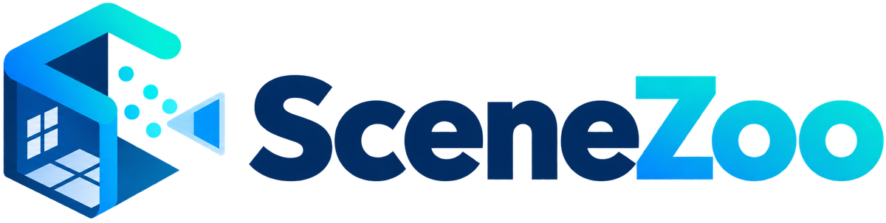
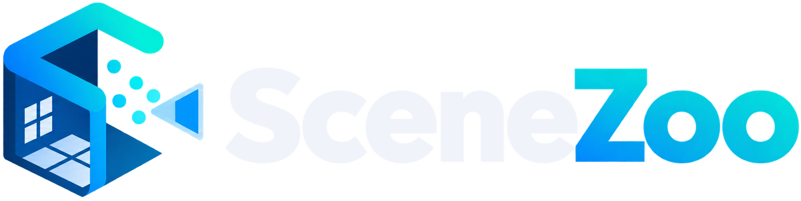
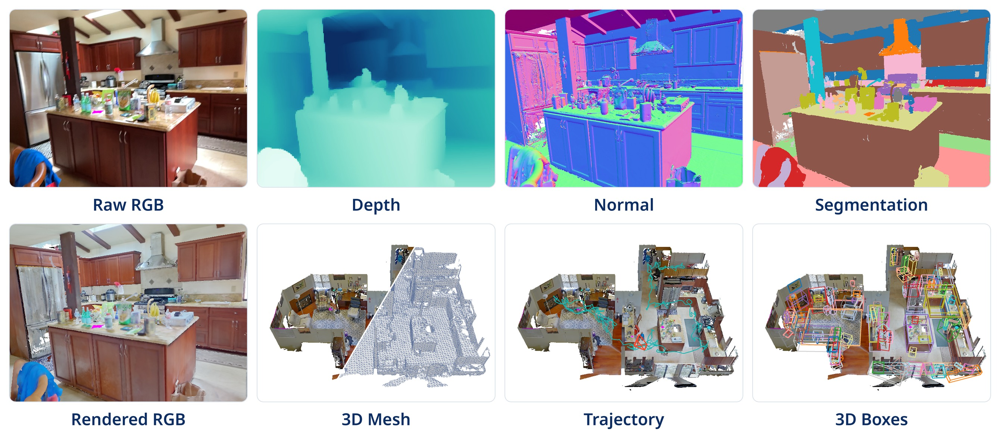

SceneZoo
=========

**SceneZoo** reads popular 3D indoor-scene datasets (such as ScanNet,
ScanNet++, ARKitScenes, and Matterport3D) through one Python API.
Point it at a dataset you have downloaded, and get meshes, point clouds,
segmentation labels, 3D boxes, and synchronized RGB-D frames with cameras as
NumPy arrays and Open3D objects, without writing a new loader for every
dataset.

.. code-block:: python

   from scenezoo import get_dataset

   dataset = get_dataset("scannetppv2", "/path/to/scannetpp")
   scene_id = dataset.get_ids("nvs_sem_train")[0]

   mesh = dataset.get_mesh(scene_id)                  # Open3D TriangleMesh
   labels = dataset.get_segmentation(scene_id)        # per-vertex instance IDs
   frames = dataset.get_frames(                       # RGB-D + cameras
       scene_id,
       source="iphone",
       indices=[0, 60, 120],
       items=("rgb", "depth", "rgb_intrinsics", "world_to_camera"),
   )
   print(frames.rgb.shape, frames.world_to_camera.shape)

Why SceneZoo
-------------

- **Built-in datasets, and room for yours.** ScanNet, ScanNet++, ARKitScenes,
  MultiScan, Aria Synthetic Environments, 3RScan, S3DIS, Matterport3D, SceneNN,
  Structured3D, and 3D-FRONT are built in (see :doc:`datasets/index`), and you can
  register your own datasets with the same API (see
  :doc:`guide/custom_datasets`).
- **Consistent conventions.** Every scene is z-up in metres, depth is always
  metres, camera poses are always OpenCV ``world_to_camera`` matrices, and
  resizing or rotating images updates the intrinsics to match. See :doc:`guide/frames`.
- **Reads the official release directly.** No conversion step: frames are
  decoded on demand from the released files (``.sens``, ``.mov``, ZIP
  sequences, and so on), and only the frames you ask for are read.
- **Tells you what is missing.** ``dataset.check()`` explains which files of a
  download are missing or still compressed. See :doc:`guide/checking`.

Where to go next
----------------

- New here? :doc:`get_started/installation`, then the
  :doc:`get_started/quickstart`.
- Looking for a recipe? :doc:`examples/index`.
- Working with one dataset? Its page under :doc:`datasets/index` lists the
  download layout, options, and extra methods.

Citation
--------

Please cite SceneZoo if you use it in your research.

.. code-block:: bibtex

   @misc{Zhang2026SceneZoo,
       author       = {Yiming Zhang},
       title        = {{SceneZoo}: A Unified {Python} Interface for {3D} Indoor-Scene Datasets},
       year         = {2026},
       howpublished = {\url{https://github.com/eamonn-zh/scenezoo}},
   }

.. toctree::
   :hidden:
   :caption: Get started

   get_started/installation
   get_started/quickstart

.. toctree::
   :hidden:
   :caption: User guide

   guide/concepts
   guide/frames
   guide/checking
   guide/custom_datasets
   guide/faq

.. toctree::
   :hidden:
   :caption: Examples

   examples/index

.. toctree::
   :hidden:
   :caption: Datasets

   datasets/index

.. toctree::
   :hidden:
   :caption: API reference

   api/core
   api/registry
   api/operations

.. toctree::
   :hidden:
   :caption: Development

   development/contributing
